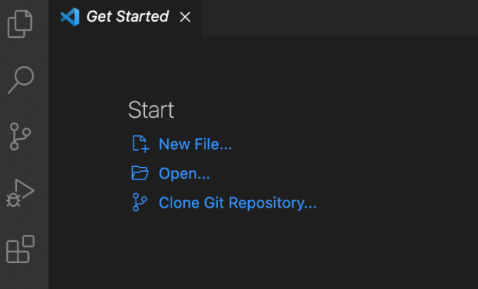
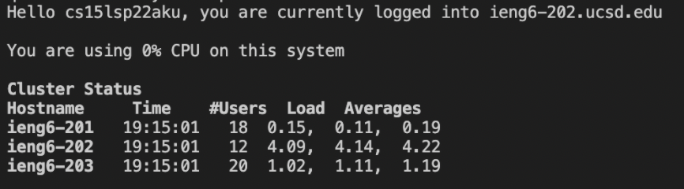
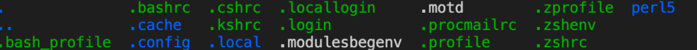
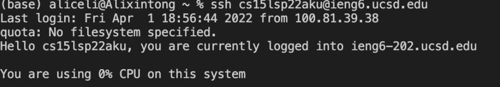
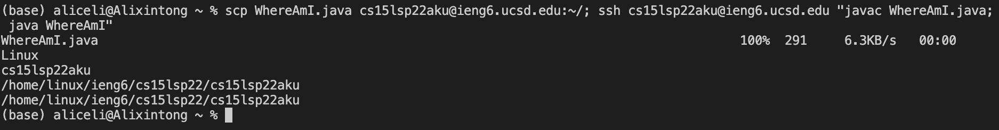

# Week 2 Lab Report

*Tutorial on how to log into course-specific account on ieng6:*

## Installing VS Code

Go to [the VS Code website](https://code.visualstudio.com/) and install the appropriate version for your computer. Once installed and opened, you should see a set-up similar to the following:

## Remotely Connecting

We will now connect to a remote computer from our machine over the Internet. Note your course-specific account for CSE 15L [here (https://sdacs.ucsd.edu/~icc/index.php), this will replace the <zz> in the following step. Open a terminal in VS Code from the menu option, and type in `cs15lsp22zz@ieng6.ucsd.edu`. For any authentication message, say `yes` and give your password when prompted, then you should see something like:
  

## Trying Some Commands

Run some commands from the terminal and see what they do, such as `cd ~`, `mkdir`, `ls -a`. For example, `cd ~` changes the home directory, and `ls -a` lists some files such that you might see:
  

## Moving files with scp

An integral aspect to remote access is being able to copy files between computers conveniently by using the command `scp`. We will run it from our computer (the one not logged into ieng6) by typing in `scp <FileName> cs15lsp22zz@ieng6.ucsd.edu:~/`. For example, for a java file called WhereAmI, you might put `WhereAmI.java` in place of `<FileName>`. Confirm that this file now exists in our ieng6 account by logging in remotely and type `ls`, the transferred file should now be listed there:
  

## Setting an SSH key

Since logging in between accounts requires a password for each time, it can be a little time consuming - luckily, we can solve this problem with `ssh` keys. On client, or your computer, type in `ssh-keygen`, when prompted, store in file `(/Users/<username>/.ssh/id_rsa): /Users/<user-name>/.ssh/id_rsa`, do **not** add a passphrase. Now we will copy the public key to `.ssh` by typing in `mkdir .ssh` on our remote-accessed account. Back on the client, type `scp /Users/<user-name>/.ssh/id_rsa.pub cs15lsp22zz@ieng6.ucsd.edu:~/.ssh/authorized_keys`, we can now use `ssh` or `scp` to switch between accounts without entering password.
  

## Optimizing Remote Running
  
We can now optimize remote running to be even faster, such as running a command directly on the remote server and exiting by putting the command in quotes at the end of an `ssh` command, sd well as using `;`s to run multiple commands on the same line. For example, we can make a local edit to `WhereAmI.java`, copying it to the remote server and running it by:
  

