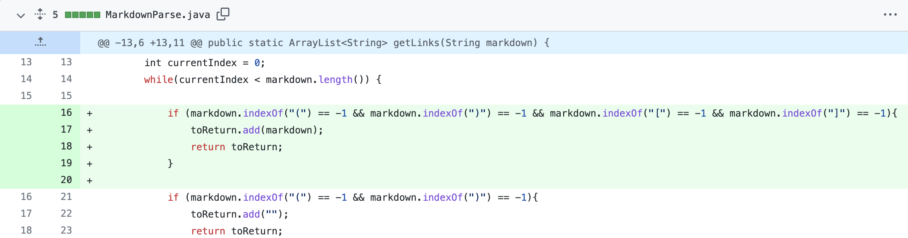
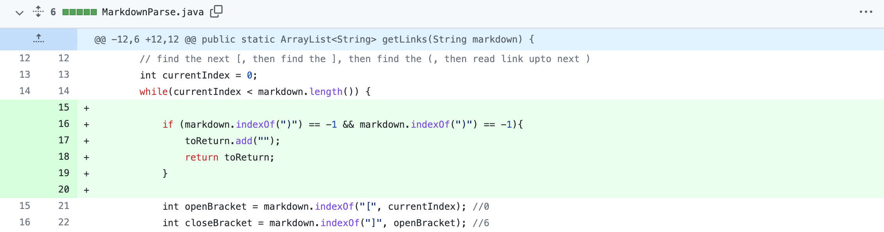
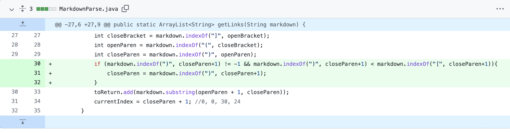

# Week 4 Lab Report

*Three code changes to fix a bug.*

## Error 1: Exception when no [link] indication is given but there is a link

Link to file with failure-inducing input: [file 4 pages](https://alixintong.github.io/markdown-parser/test-file-4.html), [file 4](https://github.com/alixintong/markdown-parser/blob/main/test-file-4.md?plain=1)
\
\
Symptom of the error-inducing input: `StringIndexOutOfBoundsException` exception.
\
\
Here, the bug, that there was no indicator `[link]` for the failure-inducing input, being `https://minesweeperonline.com/#200`. This created the symptom of a `StringIndexOutOfBoundsException`, since the code relies on finding the close and open brackets to find the link as well. So in that case, it can be remedied by creating an `if` loop to catch that case.

## Error 2: Exception when [link] denotation is given but there is no link

Link to file with failure-inducing input: [file 3 pages](https://alixintong.github.io/markdown-parser/test-file-3.html), [file 3](https://github.com/alixintong/markdown-parser/blob/main/test-file-3.md?plain=1)
\
\
Symptom of the error-inducing input: `StringIndexOutOfBoundsException` exception.
\
\
Similar to the first error, our failure-inducing input here is that we have `[link]` indicator with no link following it. We see the symptom of this as another `StringIndexOutOfBoundsException`, since no `(` or `)` is found. We can remedy this symptom by addressing the bug, making it so that if the program sees the `[link]` indicator but there is no link following it (i.e. there are no following parentheses) then it knows there is no link to return.

## Error 3: Does not return full link when there is a close parentheses in the link

Link to file with failure-inducing input: [file 2 pages](https://alixintong.github.io/markdown-parser/test-file-2.html), [file 2](https://github.com/alixintong/markdown-parser/blob/main/test-file-2.md?plain=1)
\
\
Symptom of the error-inducing input: `[a-, https://minesweeperonline.com/#200]`, does not return the full first link.
\
\
We see here that our symptom is that the full link, `a-)` which represents our failure-inducing input links with a closing parentheses within it, produces the incorrect result of `a-` as the entire link. The bug here is that our code only reads a link up to the first closing parentheses following a `[link]` indicator, hence why our symptom is that we are missing the closing parentheses in the link.
