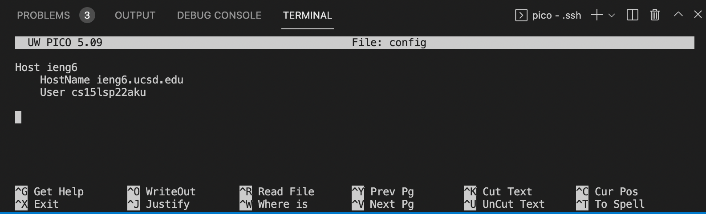
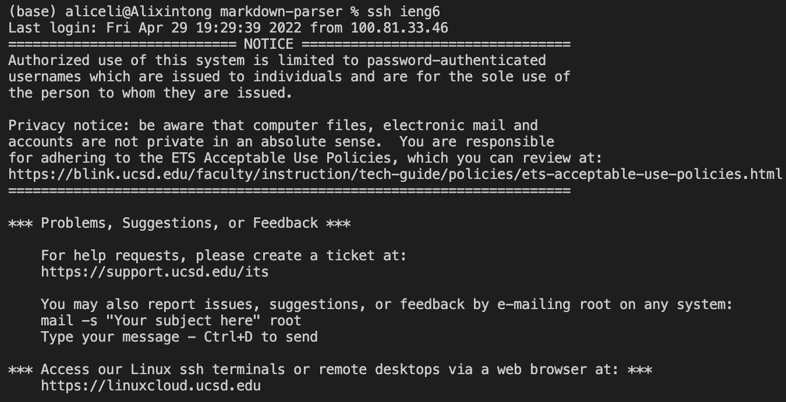
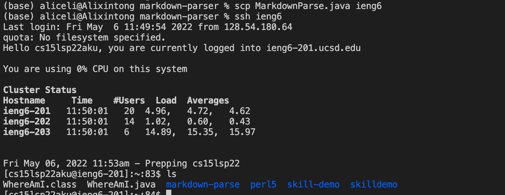
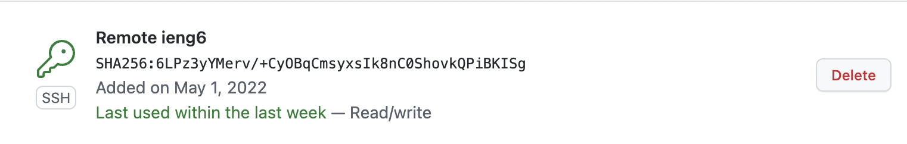
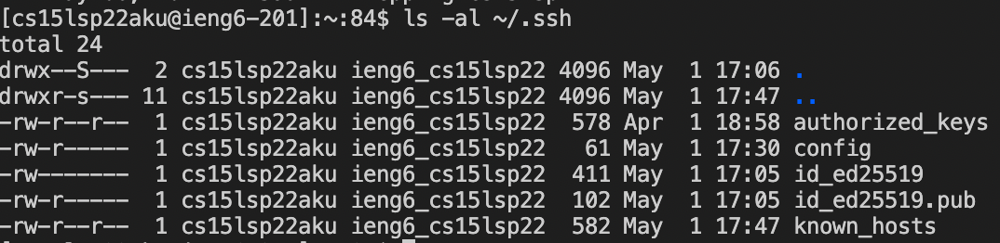
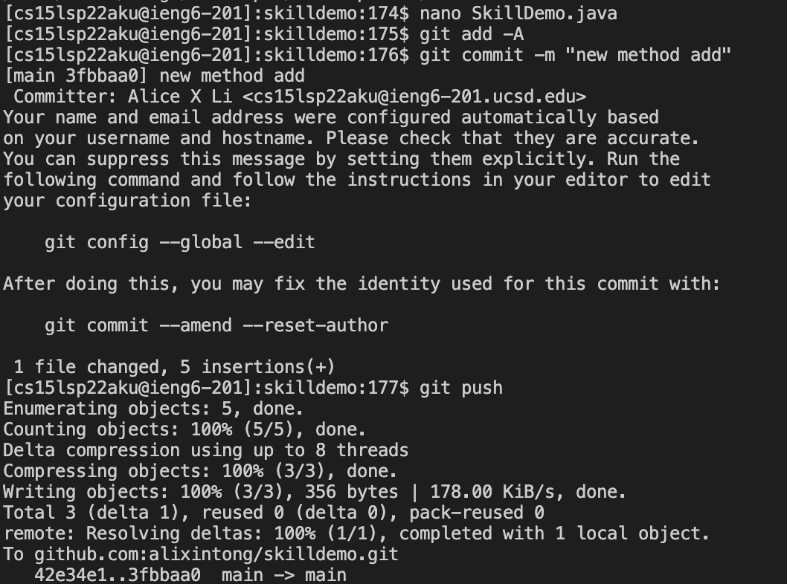

# Week 6 Lab Report

*Implementing all Group Choice Options from week 5*

## Streamlining ssh Configuration

Here, the `ssh/config` file has been set up through VScode:

\
Now we can log into the remote account with the `ssh` command using the alias `ieng6`:

\
Now we can use the `scp` command to copy the `Markdownparse.java` file to the remote account using just `ieng6`:

## Setup Github Access from ieng6

Here, we have the public key stored on Github and the private key stored in our user account:

\
Now we can make a change and use a `git` command to commit and push a change to Github from our ieng6 account:

\
We have added a new method, `add` to the `skilldemo` directory:

## Copy whole directories with `scp -r`

