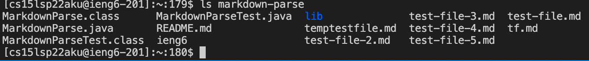
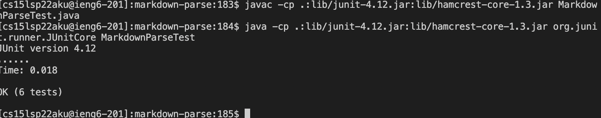
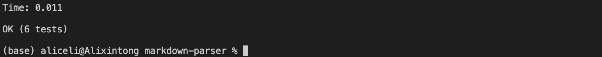

# Week 6 Lab Report

*Implementing all Group Choice Options from week 5*

## Streamlining ssh Configuration

Here, the `ssh/config` file has been set up through VScode:

Now we can log into the remote account with the `ssh` command using the alias `ieng6`:

Now we can use the `scp` command to copy the `Markdownparse.java` file to the remote account using just `ieng6`:

## Setup Github Access from ieng6

Here, we have the public key stored on Github and the private key stored in our user account:

Now we can make a change and use a `git` command to commit and push a change to Github from our ieng6 account:

We have added a new method, `add` to the `skilldemo` directory:

## Copy whole directories with `scp -r`

We have copied the whole markdown-parse directory to our ieng6 account:

Now we can compile and run the tests for our repository:

we can combine `scp`, `;`, and `ssh` to copy the whole directory and run the tests in one line:
\
`scp -r . ieng6:markdown-parse; ssh ieng6 "cd markdown-parse; /software/CSE/oracle-java-17/jdk-17.0.1/bin/javac -cp .:lib/junit-4.12.jar:lib/hamcrest-core-1.3.jar MarkdownParseTest.java; /software/CSE/oracle-java-17/jdk-17.0.1/bin/java -cp .:lib/junit-4.12.jar:lib/hamcrest-core-1.3.jar org.junit.runner.JUnitCore MarkdownParseTest"` to result in

