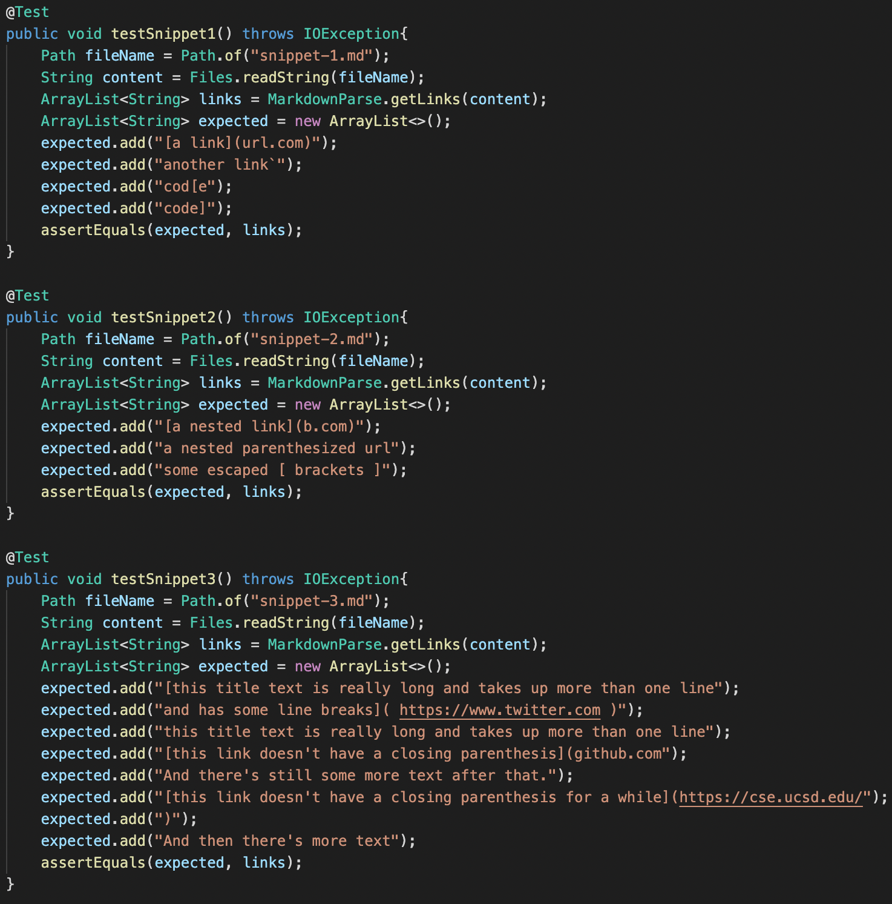
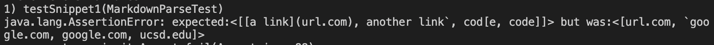
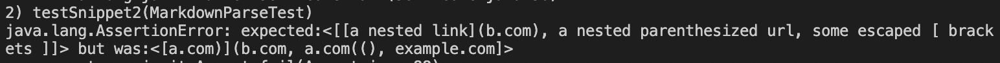
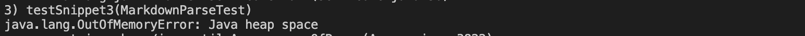
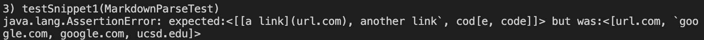
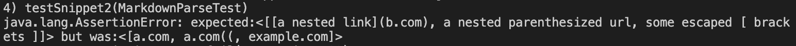
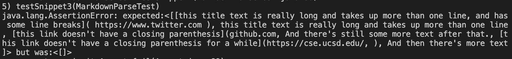

# Week 8 Lab Report

*Testing markdown snippets*

Link to my `markdown-parse` repository: [link](https://github.com/alixintong/markdown-parser)
\
Link to `markdown-parse` reviewed in Week 7: [link](https://github.com/Shresthhooda/markdown-parser)

Here are the tests added, with the correct outputs added using [CommonMark](https://spec.commonmark.org/dingus/):

## Results for my implementation
All three added tests did not pass.
Test failure for `snippet 1`:

Test failure for `snippet 2`:

Test failure for `snippet 3`:

## Results for reviewed implementation
All three added tests did not pass.
Test failure for `snippet 1`:

Test failure for `snippet 2`:

Test failure for `snippet 3`:

## Conclusion
For snippet 1, I think there exists a small code change such that my `markdown-parse` can account for backticks. 
For example, we could read if there are backticks, and if there are, whether they are enclosed in `[, ]` or `(, )` 
brackets to check whether they should be present in the output or not.
\
\
For snippet 2, I think its doable to account for these cases in less than 10 lines if implemented correctly. 
We can probably just check for the indexes of the `[, ]` brackets, if there are equal amounts, we can pair them up and have the 
furthest two represent the link brackets. If there are more `[`, we pair up brackets without that, same goes for more `]`.
\
\
I think snippet 3 involves a little more restructuring of my code, and may take more than 10 lines. This is due in part to the fact that in my
own tests, I usually counted on there only having one link test per test file. In needing to account for newlines, I will also probably
have to change some of my previous implementations which were supposed to catch previous test cases.
