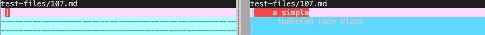
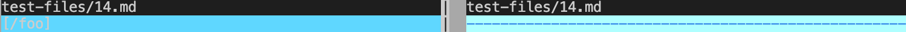
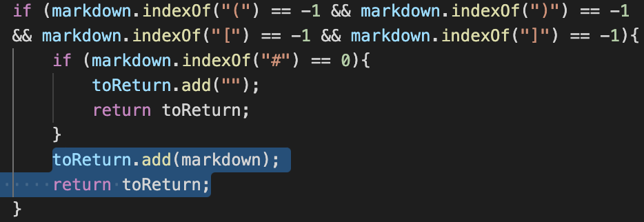
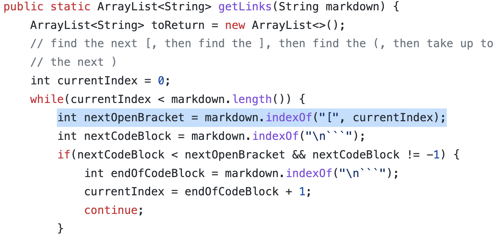

# Week 10 Lab Report

Here we can see some tests with different results by running `vimdiff`: 
`vimdiff results.txt resultsv2.txt`, where `results.txt` is the shared repo result, `resultsv2.txt` is my repo result.
Here are a two tests with different results (left-shared, right-own):

## test-files/107.md

[Link](https://github.com/nidhidhamnani/markdown-parser/blob/main/test-files/107.md?plain=1) to the test file with different results.
\
Using the [CommonMark](https://spec.commonmark.org/dingus/?text=%20%20%20%20a%20simple%0A%20%20%20%20%20%20indented%20code%20block) website,
the correct implementation should give: `[]`, or no links.
\
This means that the shared repo result is correct.

## test-files/14.md

[Link](https://github.com/nidhidhamnani/markdown-parser/blob/main/test-files/14.md?plain=1) to the test file with different results.
\
Using the [CommonMark](https://spec.commonmark.org/dingus/?text=%5C*not%20emphasized*%0A%5C%3Cbr%2F%3E%20not%20a%20tag%0A%5C%5Bnot%20a%20link%5D(%2Ffoo)%0A%5C%60not%20code%60%0A1%5C.%20not%20a%20list%0A%5C*%20not%20a%20list%0A%5C%23%20not%20a%20heading%0A%5C%5Bfoo%5D%3A%20%2Furl%20%22not%20a%20reference%22%0A%5C%26ouml%3B%20not%20a%20character%20entity) website,
the correct implementation should give: `[]`, or no links.
\
This means that neither gives the correct output, since my implementation has no return (possibly due to runtime error).

## Review
For `test-files/107.md`, my output was incorrect since my code checks if there are no parentheses, `(, ), [, ]`, and there are no comments at the beginning,
then it automatically returns what was given. This is because early in development, the stipulation was designed to catch a specific case.
\
Here is where the code should be fixed, so that if there are no parentheses, then it should return nothing:

For `test-files/14.md`, the shared repo result is incorrect since it does not check for `\` before any link brackets, which invalidates the link.
\
Here is where the code can be fixed, so that there is an extra if-statement within the while loop and after the first if-statement to catch such a case where `\` might appear before and does not return the link:

