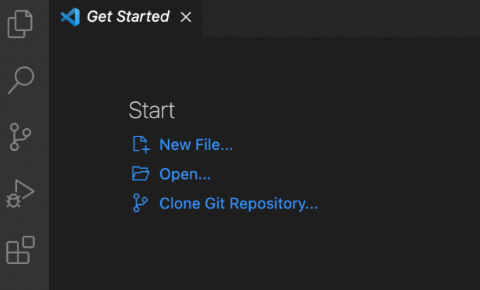

# Week 2 Lab Report

*Tutorial on how to log into course-specific account on ieng6:*

## Installing VS Code

Go to [the VS Code website](https://code.visualstudio.com/) and install the appropriate version for your computer. Once installed and opened, you should see a set-up similar to the following:

## Remotely Connecting

## Trying Some Commands

## Moving files with scp

## Setting an SSH key

## Optimizing Remote Running
