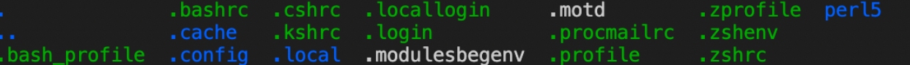

# Week 2 Lab Report

*Tutorial on how to log into course-specific account on ieng6:*

## Installing VS Code

Go to [the VS Code website](https://code.visualstudio.com/) and install the appropriate version for your computer. Once installed and opened, you should see a set-up similar to the following:

## Remotely Connecting

We will now connect to a remote computer from our machine over the Internet. Note your course-specific account for CSE 15L [here (https://sdacs.ucsd.edu/~icc/index.php), this will replace the <zz> in the following step. Open a terminal in VS Code from the menu option, and type in `cs15lsp22zz@ieng6.ucsd.edu`. For any authentication message, say `yes` and give your password when prompted, then you should see something like:
  

## Trying Some Commands

Run some commands from the terminal and see what they do, such as `cd ~`, `mkdir`, `ls -a`. For example, `cd ~` changes the home directory, and `ls -a` lists some files such that you might see:
  

## Moving files with scp

## Setting an SSH key

## Optimizing Remote Running
